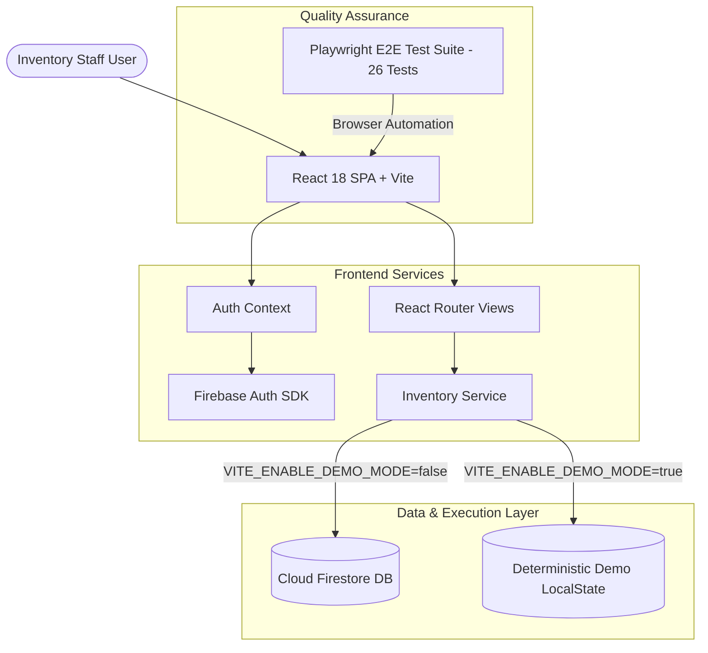

# StockFlow — Architecture Specification

---

## 1. Executive Summary & Problem Context
StockFlow is an automated inventory order-fulfillment system designed for high-concurrency warehouse environments. The system guarantees atomic stock reservation during order placement and atomic stock restoration during order cancellation, eliminating overselling and inventory race conditions.

---

## 2. System Architecture Diagram



---

## 3. React Frontend Architecture
- **Component Design**: Modular page components (`LoginPage`, `DashboardPage`, `ProductsPage`, `CreateOrderPage`, `OrderDetailsPage`) supported by shared components (`Navbar`).
- **State Management**: React Context (`AuthContext`) manages user authentication state, while component-local hooks manage dynamic form inputs and asynchronous data fetches.
- **Styling Architecture**: Custom design system in `src/index.css` utilizing modern CSS custom properties (`--bg-primary`, `--accent-blue`, `--accent-green`, `--text-primary`), dark mode glassmorphism, responsive flex/grid layouts, and badge indicators.

---

## 4. Firebase Architecture & Data Flow

### Authentication Flow
1. Staff user enters credentials into `LoginPage`.
2. `AuthContext.signIn` authenticates against Firebase Auth (`signInWithEmailAndPassword`) or checks credentials in Demo Mode.
3. Upon success, user session token is held in memory and `onAuthStateChanged` updates `currentUser`. Protected routes enforce auth guards.

### Firestore Database Schema
- **`products`**: Document ID per product containing `name`, `sku`, `price`, `availableStock`, `category`.
- **`orders`**: Document ID per order containing `orderNumber`, `customerName`, `status` (`Fulfilled`, `CANCELLED`), `totalAmount`, `totalItems`, `createdAt`, `createdBy`.
- **`orderItems`**: Document ID per line item containing `orderId`, `productId`, `productName`, `quantity`, `price`, `lineTotal`.

---

## 5. Transactional Data Flow Algorithms

### A. Order Creation Flow (Atomic Stock Deduction)
```text
UI -> createOrderAtomic(input)
  Phase 1: Validation & Read Lock
    FOR EACH item IN order_request:
      FETCH product_doc FROM db
      IF product_doc NOT EXISTS -> THROW Error("Product not found")
      IF requested_qty > product_doc.availableStock -> THROW Error("Insufficient stock")
      ACCUMULATE line_total AND stock_update

  Phase 2: Atomic Commit
    FOR EACH update IN stock_updates:
      WRITE product_doc.availableStock = (currentStock - requested_qty)
    WRITE order_doc
    WRITE order_item_docs
```

### B. Order Cancellation Flow (Atomic Stock Restoration)
```text
UI -> cancelOrderAtomic(orderId)
  Phase 1: State Validation & Read Lock
    FETCH order_doc FROM db
    IF order_doc NOT EXISTS -> THROW Error("Order not found")
    IF order_doc.status == "CANCELLED" -> THROW Error("Order is already cancelled")
    FETCH order_items FROM db

  Phase 2: Atomic Commit
    FOR EACH item IN order_items:
      FETCH product_doc FROM db
      WRITE product_doc.availableStock = (currentStock + item.quantity)
    WRITE order_doc.status = "CANCELLED"
```

---

## 6. Security Architecture
- **Explicit Demo Mode**: Demo Mode is disabled by default and requires explicit configuration (`VITE_ENABLE_DEMO_MODE=true`). If Firebase configuration is missing without explicit Demo Mode, the app renders a high-visibility configuration error banner (`data-testid="config-error-alert"`).
- **Backend Rules (`firestore.rules`)**: Enforces authentication, schema document structure, positive price values, and stock reduction limits (`request.resource.data.availableStock <= resource.data.availableStock`).

---

## 7. Automated Test Architecture
- **Playwright Suite**: 26 E2E tests targeting `data-testid` selectors across 6 test modules (`auth.spec.ts`, `order-success.spec.ts`, `edge-cases.spec.ts`, `order-validation.spec.ts`, `inventory-integrity.spec.ts`, `order-cancellation.spec.ts`).
- **Isolation Strategy**: `beforeEach` triggers `seed-products-btn` to re-seed catalog stock levels before every single test case.
