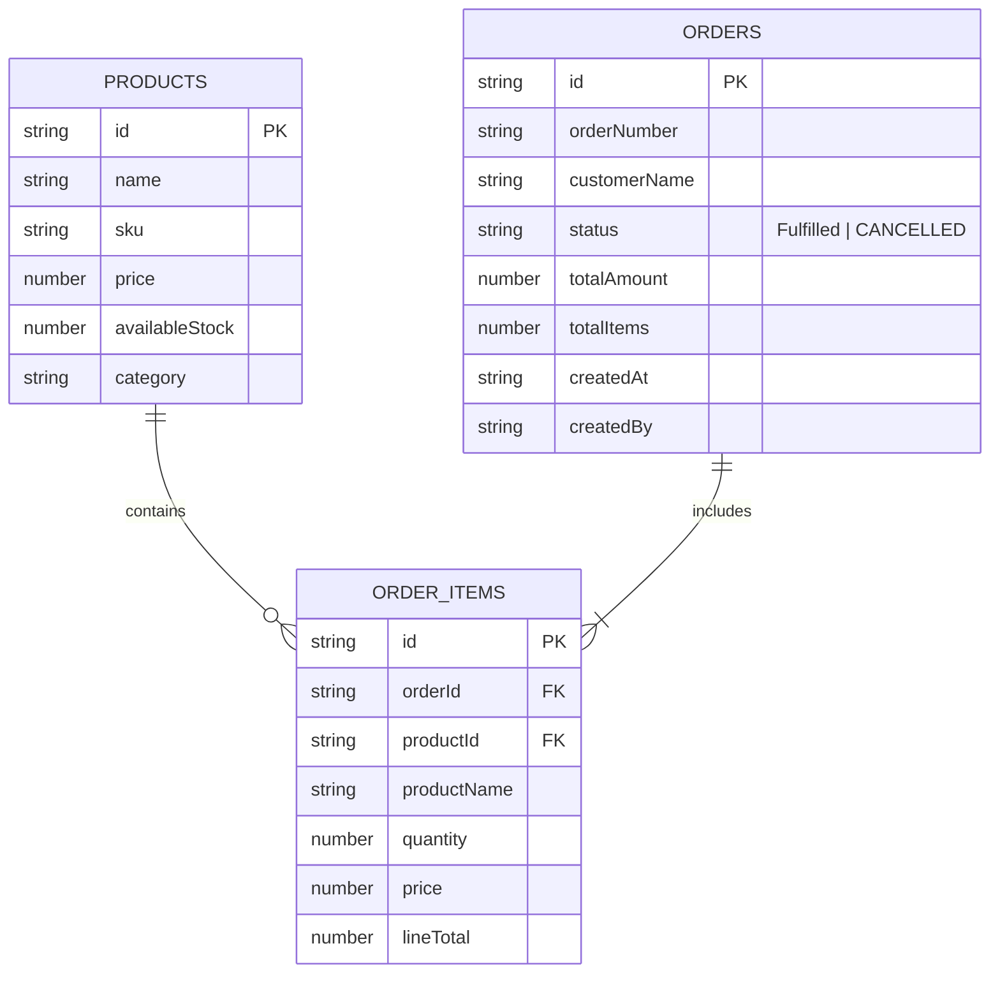

# StockFlow — Technical Design Document

---

## 1. Functional Requirements & Business Rules

### Core Requirements
1. **User Authentication**: Staff users log in with email/password. Unauthenticated access to protected inventory routes is blocked.
2. **Catalog Browsing**: Users view real-time inventory levels, SKUs, pricing, and stock status badges (`In Stock`, `Low Stock`, `Out of Stock`).
3. **Order Composition**: Multi-product customer orders are composed via an intuitive form with live quantity validation and running subtotal calculations.
4. **Atomic Fulfillment**: Stock is deducted atomically upon order placement. If stock is insufficient, order submission is blocked.
5. **Atomic Cancellation**: Confirmed orders can be cancelled. Cancelling an order restores all reserved line item quantities atomically ($stock = currentStock + Q$) and updates status to `CANCELLED`.

### Business Rules (BR-01 to BR-11)
- **BR-01**: Product must exist in catalog.
- **BR-02**: Item quantities must be positive integers ($Q \ge 1$).
- **BR-03**: Item quantities cannot exceed `availableStock`.
- **BR-04**: Successful orders decrement stock by exact ordered quantity ($remaining = current - Q$).
- **BR-05**: Multi-product failures trigger full transaction rollback with zero stock changes.
- **BR-06**: Orders must contain $\ge 1$ line item.
- **BR-07**: Customer name is required and non-empty.
- **BR-08**: Multiple distinct product line items supported per order.
- **BR-09**: Atomic transactional guarantee via Firestore `runTransaction` / local transactional mutex.
- **BR-10**: Confirmed orders can be cancelled. Cancelling an order restores reserved product stock atomically ($stock = currentStock + Q$) and transitions status to `CANCELLED`.
- **BR-11**: Double cancellation is prevented. Attempting to cancel an already cancelled order throws `Order is already cancelled` and leaves stock 100% unchanged.

---

## 2. Firestore Data Model Design

### Entity Relationship Diagram

---

## 3. UI Workflows & Form Validation Logic

### Order Composition Flow
1. User enters customer name into `customer-name-input`. Form checks `name.trim().length > 0`.
2. User selects product from `product-select-dropdown` and inputs quantity into `quantity-input`.
3. Clicking `add-item-btn` validates:
   - Is quantity a positive integer ($Q \ge 1$)?
   - Is quantity $\le$ selected product's `availableStock`?
   - Is item already in manifest? (If yes, updates quantity subject to stock limit).
4. Submitting order disables button, sets pending state, and executes `createOrderAtomic`.
5. Upon success, user is redirected to `/orders/:id` displaying the success banner, reserved items table, and updated stock balances.

### Order Cancellation Flow (Stage 3)
1. Staff user views an active order on `/orders/:id`.
2. UI verifies `order.status !== 'CANCELLED'` and displays `cancel-order-btn`.
3. Clicking `cancel-order-btn` triggers `cancelOrderAtomic(order.id)`.
4. Service validates order state and atomically adds reserved item quantities back to physical product stock.
5. Status badge (`detail-order-status`) transitions to red `CANCELLED`, `cancel-order-btn` becomes hidden, and `cancel-success-banner` displays confirmation.

---

## 4. Error Handling & Atomicity
- **Form Level**: Real-time inline alert banners (`data-testid="order-warning-alert"`) display explicit validation errors for zero quantities, negative quantities, overstock requests, or empty customer names.
- **Service Level**: Both `createOrderAtomic` and `cancelOrderAtomic` wrap execution in a two-phase transaction. If any validation fails during Phase 1, an exception is thrown, rolling back all pending updates.

---

## 5. Security & QA Design
- **QA Selectors**: Unique `data-testid` attributes placed on all interactive inputs, buttons, table rows, and alert banners (`cancel-order-btn`, `detail-order-status`, `cancel-success-banner`, `cancel-error-alert`).
- **Known Limitations**:
  - Partial line item refunds are out of scope (orders are cancelled in full).
  - Multi-warehouse location routing is out of scope for this assessment.
